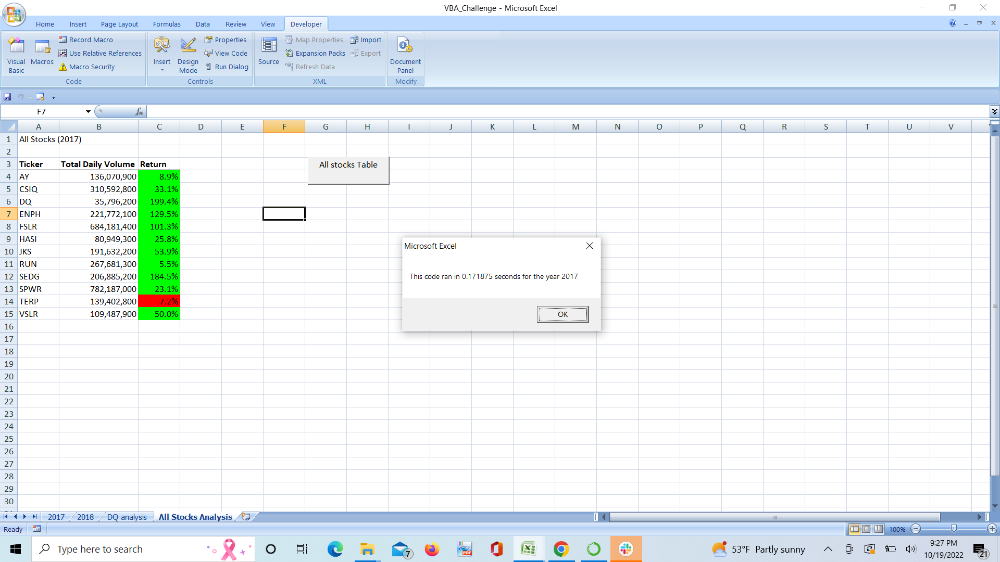
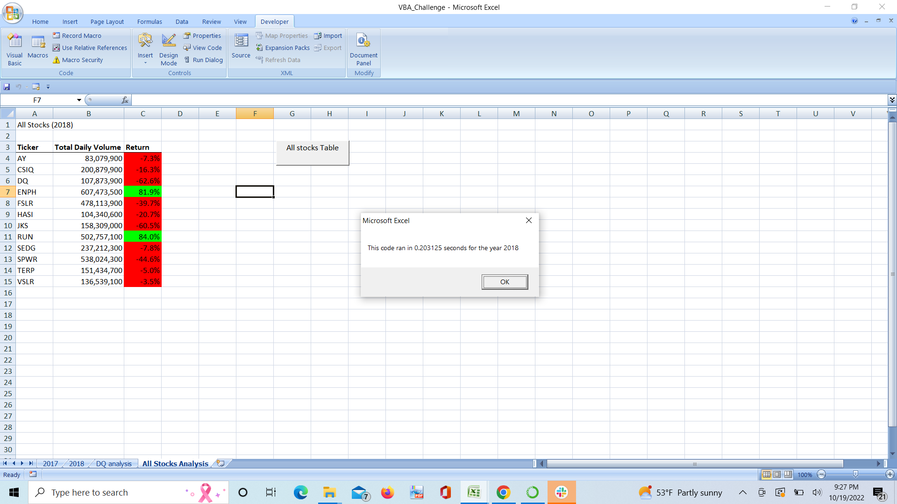

# STOCK ANALYSIS

stock-analysis 

## 1) Overview of Project

###### Purpose of the analysis ######

-This Project conatins the whole **VBA Coding Method**, from start to end. From creating **macros** to **how to do formatting through the code** when we compile and run   the code. we can get all our little silly mistakes to logical mistakes,too. Through this Analysis we know about our own ability of coding.
-In this Analysis we perform the several function and used that to retriving our desired result. We perform the analysis on **Stock Ticker** which is basically given in an **Excel data form** and with the use of coding at the end of the code we retrive the data based on yeaars.
-In the output we see 3 Columns name **Ticker,Total Daily Volume and Return** with **12 rows** which contains **name of tickers**. **Return coloumn** display the data in **percentage** form, as well as because of the cell **formating code** we see the different **color** in the cells as per condition we write in the code.so, it will be easy to find the return value which is dropped into the **negetive numbers**.

## 2) comparision of Stock performance between year 2017 and 2018 through the Inagies and example of code as well as compile time of the script.

######  **Execution Timing**
      The original code is executing more fatser than the refrector code. The images are below which shows the execution time.
**Images**

 when we perform execution on code again and again the both code took same time to execute the code. The following Images are shows same execution timing for both.
 **images**
 

###### **Stock Value Comparision**
###### **Drastic change in stocks**
###### **summery of Comaprision**

## 3) summary
  ###### **1)Advantages and Disadvantages of refactoring code**
  ###### **2)How do these Pros and Cons apply to refactoring the original VBA Script**

