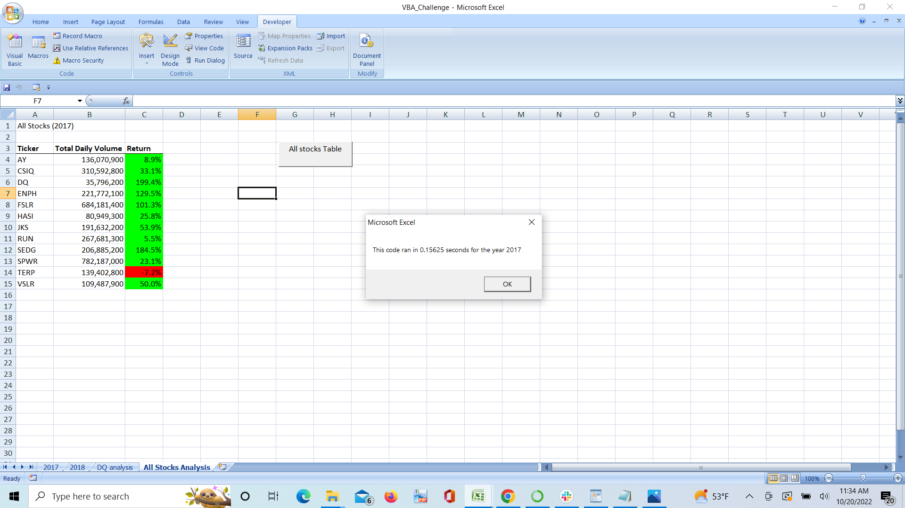
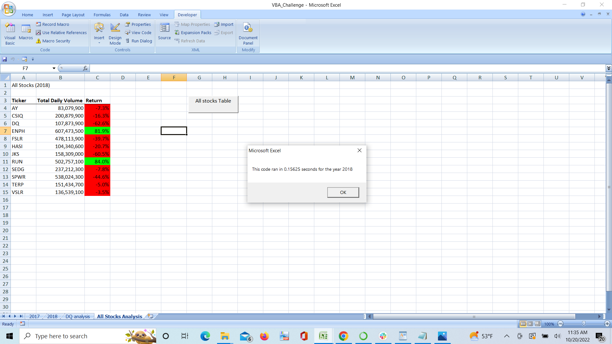

# STOCK ANALYSIS

stock-analysis 

## 1) Overview of Project

###### Purpose of the analysis ######

-This Project conatins the whole **VBA Coding Method**, from start to end. From creating **macros** to **how to do formatting through the code** when we compile and run   the code. we can get all our little silly mistakes to logical mistakes,too. Through this Analysis we know about our own ability of coding.
-In this Analysis we perform the several function and used that to retriving our desired result. We perform the analysis on **Stock Ticker** which is basically given in an **Excel data form** and with the use of coding at the end of the code we retrive the data based on yeaars.
-In the output we see 3 Columns name **Ticker,Total Daily Volume and Return** with **12 rows** which contains **name of tickers**. **Return coloumn** display the data in **percentage** form, as well as because of the cell **formating code** we see the different **color** in the cells as per condition we write in the code.so, it will be easy to find the return value which is dropped into the **negetive numbers**.

## 2) comparision of Stock performance between year 2017 and 2018 through the Inagies and example of code as well as compile time of the script.

######  **Execution Timing**
      The original code is executing more fatser than the refrector code. The images are below which shows the execution time.
**Images**

 when we perform execution on code again and again the both code took same time to execute the code. The following Images are shows same execution timing for both.
 **images**
 
 
 

###### **Stock Value Comparision**
      As we take a look on the **2018** analysis table only **ENPH** and **RUN** Tickers aree grown **above 80%** the rest of the stocks value are dropped down under the **negative numbers**
      
      
     On the other side if we look forward to year 2017 only **TERP's** return values are dropped down in **negative numbers**, rest of the tickers return values are under the positive values category.
    
###### **Drastic change in stocks**
            There is a drastic change for the ticker run over the year. As we can see it **raised** from **5.5% to 84.0% ** which is a huge changes in comapare to the year 2017
            
###### **summery of Comaprision**
      so from the comparision of both years data the year **2017** looks more `rgb(9, 105, 218) successfull` for the stock market in compare to the year **2018**.
      
## 3) summary
  ###### **1)Advantages and Disadvantages of refactoring code**
      As per my point of view there is a advanatages and disadvantages of refractoring code
      ######**Advantages**
           - From the refrectoring code we should undertand method of code. We can easily figure out about the syntax and functions which we have to apply for the desire result.
           - Refectoring code clear our mind if we have any confusion about the code in our mind. 
           
      ######**Disadvantages
      I think because of the refactoring script we only think under the limit.it sets the boundry towards the code in our mind so we can not think beyond that sometimes.
      otherwise , refrectoring code is very helpfull for new commers and the people who coming outside the stream. 
      
  ###### **2)How do these Pros and Cons apply to refactoring the original VBA Script**
      So we can take much advantages from the refrectoring code as we can. And for cons, we also hace to think beyond the limit of the refrectoring code.

